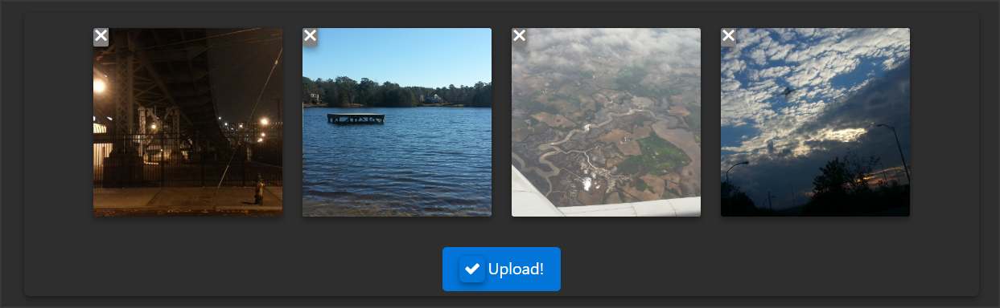

[NPM](https://www.npmjs.com/package/vue-upload-image)

# vue-upload-image
Configurable image uploader with preview

 + drag and drop with input backup
 + image previews
 + simple resizing
 + events
 + minimal
 + configurable



## Installation

```bash
npm install vue-upload-image --save
```

Vue.prototype.$http must be define. 
[info](https://medium.com/the-vue-point/retiring-vue-resource-871a82880af4#.z4rqh1qtp)


#### ES6
```js
import UploadImage from 'vue-upload-image';

new Vue({
    template: '<upload-image url=""></upload-image>',
    components: {
        UploadImage
    }
})
```

```html
<upload-image url="" name="" max_files=""></upload-image>
```

```css
.vue_component__upload--image
    .upload_image_form__thumbnails
        .upload_image_form__thumbnail [&.bad-size, &.uploaded]
            .img [&.show, &:hover]
            span
```
## Events
* upload-image-attempt -> [FormData]
* upload-image-success -> [FormData, Response]
* upload-image-failure -> [FormData, Response] 

## Configuration
```js
input_id: { // Id of upload control
    type: String,
    required: false,
    default: "default"
},
url: { // upload url
    type: String,
    required: true,
    default: null
},
name: { // name to use for FormData
    type: String,
    required: false,
    default: 'images[]'
},
max_batch: { // # of files to upload within one request
    type: Number,
    required: false,
    default: 0
},
max_files: { // total # of files allowed to be uploaded
    type: Number,
    required: false,
    default: 10
},
max_filesize: { // max files size in KB
    type: Number,
    required: false,
    default: 8000
},
resize_enabled: { // resize image prior to preview/upload
    type: Boolean,
    required: false,
    default: false
},
resize_max_width: { // resize max width
    type: Number,
    required: false,
    default: 800
},
resize_max_height: { // resize max height
    type: Number,
    required: false,
    default: 600
},
button_html: { // text/html for button
    type: String,
    required: false,
    default: 'Upload Images'
},
button_class: { // classes for button
    type: String,
    required: false,
    default: 'btn btn-primary'
}
```

## License
[MIT](http://vjpr.mit-license.org)
